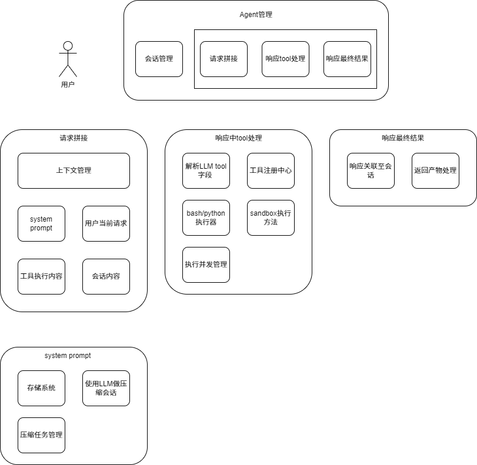

# 从头想一遍agent设计

## 前置背景
在思考 agent 设计之前，可先看一遍 DeepSeek 的 api 文档。
其中多轮对话、JSON Output 和 Tool Calls 可以看几遍，体会一下接口设计。
多轮对话：每次对话是需要把之前的用户提问和AI回答都拼接入请求中。
JSON Output：若希望 AI 返回时有一些回答原则，则可以通过 system prompt 把和用户提问一起提交给 AI。
Tool Calls：调用 client.chat.completions.create 时，参数中有 model、messages 和 tools，我们可以把工具的相关信息填入 tools 参数。第一次 AI 返回内容有工具调用时，需要本地执行完工具，拿到返回结果，加入到 messages 参数，再提交给 AI 拿到最终结果。

## 整体架构

从整体看，agent 项目就是处理一个很简单的流程，用户发送一个请求至服务端的 agent，请求一般为一段文字，然后 agent 做请求的解析、处理和返回的工作。

## agent 管理模块

一般而言，一个可处理事务的 agent 会有自己独立的内容，有些项目支持多个 agent，有些项目只支持一个 agent，但 agent 管理模块是每个项目必备的。

有了一个 agent 后，针对用户的请求，还需要建立一个会话管理，每次请求都需要用户选择一个会话后发送。在一个会话内，前后的请求和返回内容可以帮助后面请求结果的生成。

每个 agent 项目后面为 LLM，agent 需要处理用户请求、agent 个性化信息以及与 LLM 的交互。接收到用户请求后，agent 处理主要是三部分，
1. 拼接发送至 LLM 的请求内容。
2. 接收 LLM 响应，完成 LLM 响应中的待办任务。
3. 整合所有内容，转化为用户想要的格式，然后把响应返回给用户。

## 请求拼接模块

从接口文档看，因为 AI 的接口是无状态的，所以我们需要一个上下文管理模块，把在一个请求中需要的消息管理起来。大概包括几个内容，具体如下：
1. system prompt：主要内容是我们对这个 agent 的要求，在一些 agent 的设计中，还会包括 AI 从对话内容中提取的内容，例如用户对某些内容的定义、用户提到的一些事实、日常对话内容等。这一块内容因为是需要持久化，并需要多做一个管理。
2. 用户当前输入的请求：这个内容不用说，是一定要传递给 AI。
3. 工具执行内容：当用户提交的问题需要工具执行时，AI 会返回怎么调用工具，本地在执行完工具后，需要把工具执行结果拼接入用户下一次请求中，并告诉工具执行已完成。
4. 会话内容：在用户与 AI 对话时，我们潜意识里是基于上下文聊天的，例如我们会基于 AI 的回答或我们上一个提问去追问，这时候发送给 AI 需要把会话中的内容一起发送给 AI，这个时候，部分信息需要去除或整理，例如推理内容大部分情况不需要，例如过于重复的信息可以去除。

## 响应中 tool 处理

1. 解析 LLM tool 字段：向 AI 提问时，若添加了可用工具的 tools 字段，AI 发现需要使用其中某些工具时，在返回结果中 tool_calls 填入工具调用信息。例子详见 [2]
2. 工具注册中心：工具执行有几种类型，一、本地方法，代码写在 agent 项目，在调用时只需要反射出具体方法就可以直接执行。二、mcp 类型，直接通过 http 请求从其他地方获取结果。三、skill 类型，在文档中指定，可能是执行 python，也可能是执行 python。
3. bash/python 执行器：bash/python 两种类型是最基础的工具，例如 ls 需要 bash 执行器。这时候 agent 项目需要把 bash/python 的执行结构抽象好，并把这两个基础方法注册至工具注册中心。
4. sandbox 执行方法：执行具体工具，可以运行在本地，也可以运行在 docker 中，也可以运行在 k8s 中，不同的 agent 项目支持粒度不同。在工具实际执行之前，一般会有危险操作检测流程，若工具执行有点危险，会让用户做选择，是否实际执行。
5. 执行并发管理：一个会话可能会有很多人工具需要执行，并且用户可能同时发送多个请求，这就导致 agent 会同时收到多个工具执行，这时候，我们可以做一个并发模块，控制工具的执行。

## 响应最终结果

1. 响应关联至会话：在一个用户请求，agent 项目需要抽象一个执行结构，agent 项目会把涉及到的所有内容包含进去，包括请求，响应，工具执行结果，prompt 等。
2. 返回产物处理：在一个 agent 的请求结果中，有可能会返回一个文件，比如你想要让 AI 生成一个 html，这时候 agent 执行结果会有一个 html 类型产物，这个产物会以地址形式添加到返回结果，一般情况下，这个文件会在 bash/python 执行的机器的某个目录上。

## system prompt 模块

1. 存储系统：长期记忆主要包括几个内容，如具体请求信息、agent 性格、提取的用户概念定义等等，这部分是 agent 越来越好用的原因。目前长期记忆主要两种类型保存，一个是 md 文件，一个 sqlite 等数据库。md 文件可以保存长期记忆的文字版。sqlite 可用来保存向量版长期记忆，例如在 QwenPaw 中，引入 sqlite 存储长期机器的向量，支持以向量形式模糊地找出与用户请求相关地长期记忆内容。
2. 使用 LLM 做压缩内容：若我们发现内容超过阈值时，需要调用 LLM 对内容做压缩，例如在一个会话中，已经有太多请求和响应，又因为  LLM 的请求上下文是有限，我们在发起请求前需要把请求和响应做一次压缩，减少放入上下文的内容，可以正常的请求 LLM。
3. 压缩任务管理：压缩任务一般包含几个步骤：1、选择要压缩的内容，2、调用 LLM 做压缩。3、把压缩后的内容写回，可能时会话中，也可能是长期记忆的存储系统中。对内容做压缩的任务，一般情况下不会太快，所以一般是以任务形式存在，辅以并发管理，例如请求时检测到超过阈值，就会发起压缩任务，在后台慢慢做。

## 遗留问题列表

1. QwenPaw 中工具注册中心，默认工具有哪些？在src/qwenpaw/agents/react_agent.py 的 _create_toolkit 方法内，扫描了 src/qwenpaw/agents/tools/__init__.py 的 __all__ 列表对应的函数。
2. deerflow 的 ThreadState 是什么级别？会话级别。
3. 在需要使用 skill 的情况下，与 LLM 会有好几轮交互，可以看看交互内容具体是什么。

## 参考资料

- 1：https://api-docs.deepseek.com/zh-cn/guides/thinking_mode
- 2：https://api-docs.deepseek.com/zh-cn/guides/tool_calls
